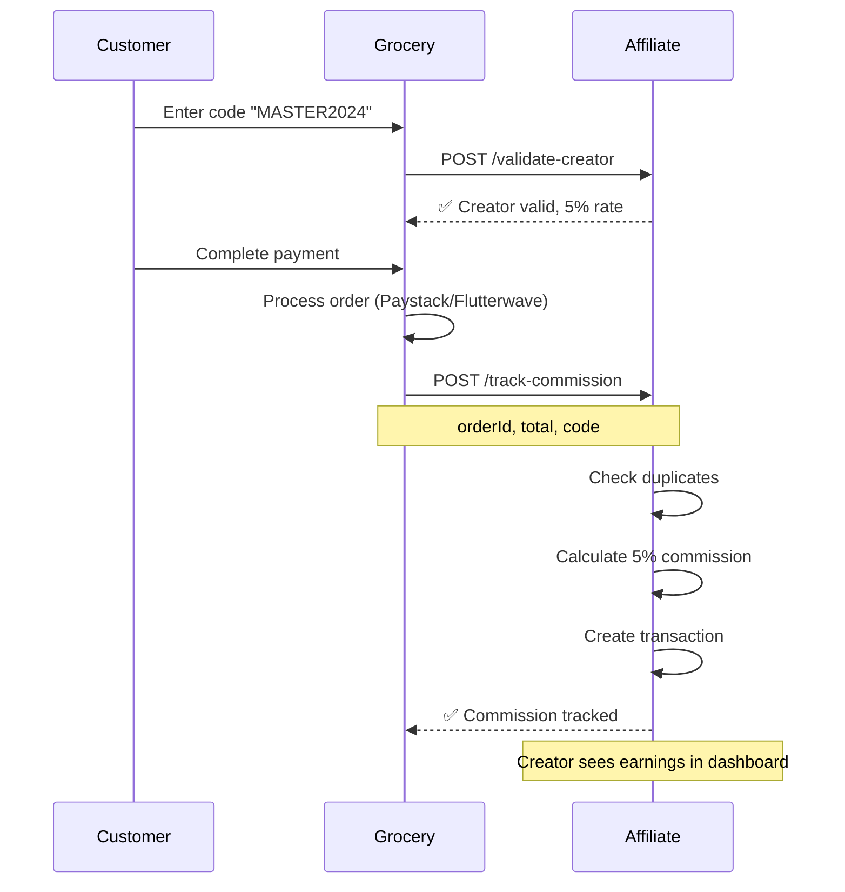

# 🔗 GROCERY STORE INTEGRATION GUIDE
## Complete API Integration Documentation

**Version:** 2.0
**Status:** Production Ready
**Last Updated:** 2025-11-14

---

## 📋 Table of Contents

1. [Overview](#overview)
2. [Authentication](#authentication)
3. [API Endpoints](#api-endpoints)
4. [Integration Flow](#integration-flow)
5. [Testing](#testing)
6. [Error Handling](#error-handling)
7. [Security](#security)
8. [Monitoring](#monitoring)

---

## 🎯 Overview

This integration allows the **Grocery Store** to:
1. **Validate creator codes** when customers check out
2. **Track commissions** automatically when orders are completed
3. **Display creator stats** publicly (optional)

### System Architecture

```
┌─────────────────┐         ┌─────────────────────┐
│  Grocery Store  │ ◄─────► │  Affiliate System   │
│   (External)    │  HTTPS  │   (This Project)    │
└─────────────────┘         └─────────────────────┘
       │                              │
       │ 1. Validate Code             │ - Validates creator
       │ 2. Complete Order            │ - Tracks commission
       │ 3. Get Stats (optional)      │ - Returns earnings
       └──────────────────────────────┘
```

---

## 🔐 Authentication

### API Key Setup

**Step 1:** Generate a secure API key for the grocery store:

```bash
# Generate a random 32-character key
openssl rand -hex 32
# Example output: a3f8b2c9d4e1f6a7b8c9d0e1f2a3b4c5d6e7f8a9b0c1d2e3f4a5b6c7d8e9f0a1
```

**Step 2:** Add to your `.env` file:

```bash
# .env
GROCERY_API_KEY=a3f8b2c9d4e1f6a7b8c9d0e1f2a3b4c5d6e7f8a9b0c1d2e3f4a5b6c7d8e9f0a1
```

**Step 3:** Share this key with the grocery store team (securely!)

### Request Headers

All API requests must include:

```http
Content-Type: application/json
x-api-key: a3f8b2c9d4e1f6a7b8c9d0e1f2a3b4c5d6e7f8a9b0c1d2e3f4a5b6c7d8e9f0a1
```

---

## 📡 API Endpoints

### Base URLs

- **Development:** `http://localhost:3001`
- **Production:** `https://your-affiliate-domain.com`

---

### 1. Validate Creator Code

**Endpoint:** `POST /api/public/validate-creator`

**Purpose:** Check if a creator code is valid before checkout

**Request:**
```json
{
  "code": "MASTER2024"
}
```

**Success Response (200):**
```json
{
  "success": true,
  "creator": {
    "id": "cm1234567890",
    "fullName": "John Doe",
    "username": "master_upliner",
    "instagramHandle": "@johndoe",
    "tiktokHandle": "@johndoe"
  },
  "commissionRate": 0.05
}
```

**Error Responses:**

| Status | Error | Meaning |
|--------|-------|---------|
| 400 | Code is required | Missing `code` field |
| 400 | Invalid code format | Code doesn't match pattern `ALPHA2024` |
| 401 | Unauthorized | Invalid or missing API key |
| 404 | Creator not found | No creator with that username |
| 500 | Server configuration error | `GROCERY_API_KEY` not set |

**Code Format Validation:**
- Must contain letters followed by 4 digits
- Examples: `MASTER2024`, `JOHN_DOE2024`, `WINNER2025`
- Invalid: `MASTER`, `2024MASTER`, `MASTER-2024`

---

### 2. Track Commission

**Endpoint:** `POST /api/public/track-commission`

**Purpose:** Create commission after successful order payment

**Request:**
```json
{
  "orderId": "grocery_order_12345",
  "orderNumber": "EMM-2024-001",
  "orderTotal": 50000,
  "affiliateCode": "MASTER2024"
}
```

**Required Fields:**
- `orderId` (string): Unique order identifier from grocery store
- `orderTotal` (number): Total order amount in Naira (e.g., 50000 = ₦50,000)
- `affiliateCode` (string): Creator code used at checkout

**Optional Fields:**
- `orderNumber` (string): Human-readable order number (for display)
- `customerEmail` (string): Customer email (for analytics)
- `timestamp` (string): ISO 8601 timestamp
- `source` (string): Platform identifier (e.g., "web", "mobile")

**Success Response (200):**
```json
{
  "success": true,
  "commission": {
    "id": "tx_987654321",
    "amount": 2500,
    "creatorId": "cm1234567890",
    "creatorName": "John Doe"
  }
}
```

**Error Responses:**

| Status | Error | Meaning |
|--------|-------|---------|
| 400 | Missing required fields | `orderId`, `orderTotal`, or `affiliateCode` missing |
| 401 | Unauthorized | Invalid or missing API key |
| 404 | Creator not found | Invalid affiliate code |
| 409 | Commission already tracked | Duplicate order ID (prevents double-payment) |
| 500 | Failed to track commission | Database error |

**Commission Calculation:**
- Rate: **5%** fixed for all creators
- Example: ₦50,000 order → ₦2,500 commission
- Maximum warning threshold: ₦50,000 (for fraud detection)

---

### 3. Get Creator Stats (Optional)

**Endpoint:** `GET /api/public/creator-stats?username=master_upliner`

**Purpose:** Display creator performance publicly

**Query Parameters:**
- `username` (required): Creator username (without year suffix)

**Success Response (200):**
```json
{
  "success": true,
  "creator": {
    "fullName": "John Doe",
    "username": "master_upliner",
    "instagramHandle": "@johndoe",
    "tiktokHandle": "@johndoe",
    "contentStyle": "Lifestyle & Food",
    "followersCount": 5000
  },
  "stats": {
    "totalEarnings": 125000,
    "totalOrders": 50,
    "contentPosts": 12
  }
}
```

**Use Cases:**
- Creator leaderboard
- Public profile pages
- Marketing materials

---

## 🔄 Integration Flow

### Complete Checkout Flow



### Step-by-Step Implementation

#### Step 1: Customer Enters Code (Checkout Page)

```javascript
// Grocery Store Frontend - checkout.js
async function validateCreatorCode(code) {
  const response = await fetch('https://affiliate-domain.com/api/public/validate-creator', {
    method: 'POST',
    headers: {
      'Content-Type': 'application/json',
      'x-api-key': process.env.AFFILIATE_API_KEY
    },
    body: JSON.stringify({ code })
  })

  const data = await response.json()

  if (data.success) {
    // Show creator info + discount/commission message
    displayCreatorInfo(data.creator)
    calculateDiscount(data.commissionRate) // Optional: Pass savings to customer
  } else {
    // Show error: "Invalid creator code"
    showError(data.error)
  }
}
```

#### Step 2: Order Completed (Webhook Handler)

```javascript
// Grocery Store Backend - paystack-webhook.js
async function handlePaymentSuccess(paystackData) {
  const { reference, amount, metadata } = paystackData

  // 1. Update order status to PAID
  await db.orders.update({
    where: { reference },
    data: { status: 'PAID' }
  })

  // 2. If order has affiliate code, track commission
  if (metadata.affiliateCode) {
    await trackAffiliateCommission({
      orderId: metadata.orderId,
      orderNumber: metadata.orderNumber,
      orderTotal: amount / 100, // Convert kobo to naira
      affiliateCode: metadata.affiliateCode
    })
  }
}

async function trackAffiliateCommission(data) {
  try {
    const response = await fetch('https://affiliate-domain.com/api/public/track-commission', {
      method: 'POST',
      headers: {
        'Content-Type': 'application/json',
        'x-api-key': process.env.AFFILIATE_API_KEY
      },
      body: JSON.stringify(data)
    })

    const result = await response.json()

    if (result.success) {
      console.log(`✅ Commission tracked: ₦${result.commission.amount}`)
    } else if (response.status === 409) {
      console.warn('⚠️ Duplicate commission attempt (already tracked)')
    } else {
      console.error('❌ Failed to track commission:', result.error)
      // Retry logic here (optional)
    }
  } catch (error) {
    console.error('❌ Network error tracking commission:', error)
    // Queue for retry
  }
}
```

#### Step 3: Retry Logic (Recommended)

```javascript
// Grocery Store - commission-queue.js
const MAX_RETRIES = 3
const RETRY_DELAY = 5000 // 5 seconds

async function trackWithRetry(data, attempt = 1) {
  try {
    const response = await trackAffiliateCommission(data)
    if (!response.success && attempt < MAX_RETRIES) {
      console.log(`Retry attempt ${attempt}/${MAX_RETRIES}`)
      await sleep(RETRY_DELAY * attempt) // Exponential backoff
      return trackWithRetry(data, attempt + 1)
    }
    return response
  } catch (error) {
    if (attempt < MAX_RETRIES) {
      return trackWithRetry(data, attempt + 1)
    }
    throw error
  }
}
```

---

## 🧪 Testing

### Test in Development

#### 1. Create Test Creator

```sql
-- Run in your affiliate database
INSERT INTO "User" (
  id, email, "fullName", username, "isCreator", "emailVerified", tier
) VALUES (
  'test_creator_123',
  'test@example.com',
  'Test Creator',
  'testcreator',
  true,
  NOW(),
  'GOLD'
);
```

#### 2. Test Validation Endpoint

```bash
curl -X POST http://localhost:3001/api/public/validate-creator \
  -H "Content-Type: application/json" \
  -H "x-api-key: your_api_key_here" \
  -d '{"code":"TESTCREATOR2024"}'
```

**Expected Response:**
```json
{
  "success": true,
  "creator": {
    "id": "test_creator_123",
    "fullName": "Test Creator",
    "username": "testcreator"
  },
  "commissionRate": 0.05
}
```

#### 3. Test Commission Tracking

```bash
curl -X POST http://localhost:3001/api/public/track-commission \
  -H "Content-Type: application/json" \
  -H "x-api-key: your_api_key_here" \
  -d '{
    "orderId": "test_order_001",
    "orderNumber": "TEST-001",
    "orderTotal": 10000,
    "affiliateCode": "TESTCREATOR2024"
  }'
```

**Expected Response:**
```json
{
  "success": true,
  "commission": {
    "id": "tx_...",
    "amount": 500,
    "creatorId": "test_creator_123",
    "creatorName": "Test Creator"
  }
}
```

#### 4. Test Duplicate Prevention

```bash
# Run the same request again - should fail
curl -X POST http://localhost:3001/api/public/track-commission \
  -H "Content-Type: application/json" \
  -H "x-api-key: your_api_key_here" \
  -d '{
    "orderId": "test_order_001",
    "orderNumber": "TEST-001",
    "orderTotal": 10000,
    "affiliateCode": "TESTCREATOR2024"
  }'
```

**Expected Response (409 Conflict):**
```json
{
  "success": false,
  "error": "Commission already tracked for this order",
  "existingCommissionId": "tx_..."
}
```

#### 5. Verify in Database

```sql
-- Check commission was created correctly
SELECT
  id,
  type,
  amount,
  "userId",
  "referralOrderId",
  "sourceUserId",
  description,
  "createdAt"
FROM "Transaction"
WHERE "referralOrderId" = 'test_order_001';

-- Should return:
-- type: COMMISSION
-- amount: 500.00
-- referralOrderId: test_order_001
-- sourceUserId: NULL (← proves it's creator commission)
```

---

## ⚠️ Error Handling

### Common Errors & Solutions

#### Error 401: Unauthorized

**Cause:** Invalid or missing API key

**Solution:**
```bash
# Check API key in .env
cat .env | grep GROCERY_API_KEY

# Verify header in request
curl -v ... | grep "x-api-key"
```

#### Error 404: Creator not found

**Cause:**
- Creator username doesn't exist
- Creator not verified (`emailVerified = null`)
- `isCreator = false`

**Solution:**
```sql
-- Check user exists and is verified
SELECT username, "isCreator", "emailVerified"
FROM "User"
WHERE LOWER(username) = 'testcreator';

-- Fix if needed
UPDATE "User"
SET "isCreator" = true, "emailVerified" = NOW()
WHERE username = 'testcreator';
```

#### Error 409: Duplicate commission

**Cause:** Order ID already used

**Solution:** This is expected behavior (prevents double-payment). If legitimate:
```sql
-- Check existing commission
SELECT * FROM "Transaction"
WHERE "referralOrderId" = 'order_123';

-- If it's a mistake, delete (DANGEROUS - only in dev!)
DELETE FROM "Transaction"
WHERE "referralOrderId" = 'order_123';
```

#### Error 500: Server error

**Cause:** Database connection, environment variable missing

**Solution:**
```bash
# Check logs
npm run dev # Look for error details

# Verify database connection
psql $DATABASE_URL -c "SELECT 1"

# Check environment variables
echo $GROCERY_API_KEY
echo $DATABASE_URL
```

---

## 🔒 Security

### API Key Best Practices

✅ **DO:**
- Use environment variables (never hardcode)
- Generate cryptographically secure keys (32+ characters)
- Rotate keys periodically (quarterly)
- Use HTTPS only in production
- Log invalid key attempts

❌ **DON'T:**
- Commit API keys to Git
- Share keys via email/Slack (use secure tools)
- Use the same key across environments
- Expose keys in client-side code

### Rate Limiting (Recommended)

Add to Nginx/Cloudflare:

```nginx
# Nginx config
limit_req_zone $binary_remote_addr zone=affiliate_api:10m rate=10r/m;

location /api/public/ {
  limit_req zone=affiliate_api burst=5;
}
```

### IP Whitelisting (Optional)

```typescript
// middleware.ts
const ALLOWED_IPS = [
  '123.45.67.89', // Grocery store server
]

export function middleware(request: NextRequest) {
  const ip = request.headers.get('x-forwarded-for')

  if (request.nextUrl.pathname.startsWith('/api/public/')) {
    if (!ALLOWED_IPS.includes(ip)) {
      return new Response('Forbidden', { status: 403 })
    }
  }
}
```

---

## 📊 Monitoring

### Health Checks

#### Daily Verification

```sql
-- Check for orphaned commissions (should be 0)
SELECT COUNT(*) as orphaned
FROM "Transaction"
WHERE type = 'COMMISSION'
  AND "sourceUserId" IS NULL
  AND "referralOrderId" IS NULL;
-- Expected: 0

-- Check today's commissions
SELECT
  COUNT(*) as count,
  SUM(amount) as total
FROM "Transaction"
WHERE type = 'COMMISSION'
  AND "referralOrderId" IS NOT NULL
  AND "createdAt" >= CURRENT_DATE;
```

#### Weekly Report

```sql
-- Top performing creators
SELECT
  u."fullName",
  u.username,
  COUNT(t.id) as orders,
  SUM(t.amount) as earnings
FROM "User" u
JOIN "Transaction" t ON u.id = t."userId"
WHERE t.type = 'COMMISSION'
  AND t."referralOrderId" IS NOT NULL
  AND t."createdAt" >= CURRENT_DATE - INTERVAL '7 days'
GROUP BY u.id, u."fullName", u.username
ORDER BY earnings DESC
LIMIT 10;
```

### Logging

```typescript
// Add to track-commission route
console.log('Commission tracked:', {
  timestamp: new Date().toISOString(),
  orderId: orderId,
  creatorId: creator.id,
  amount: commissionAmount,
  source: request.headers.get('x-forwarded-for')
})
```

### Alerts

Set up alerts for:
- ❌ API key failures (> 5/hour)
- ⚠️ Unusual commission amounts (> ₦50,000)
- 🐌 Slow response times (> 2 seconds)
- 💥 Error rate (> 1%)

---

## 📞 Support

### Contact Information

- **Email:** support@emmfort.com
- **Docs:** https://docs.emmfort.com
- **Status:** https://status.emmfort.com

### Troubleshooting Checklist

Before contacting support, verify:

- [ ] API key is correct and in request headers
- [ ] Request body matches documented format
- [ ] Creator exists and is verified in database
- [ ] Environment variables are set
- [ ] Database connection is working
- [ ] Using HTTPS in production
- [ ] Logs show detailed error messages

---

## 🚀 Quick Start Checklist

### For Grocery Store Team

- [ ] Receive API key from Emmfort team
- [ ] Add `AFFILIATE_API_KEY` to environment variables
- [ ] Implement validation endpoint in checkout flow
- [ ] Implement commission tracking in payment webhook
- [ ] Test with dummy creator code
- [ ] Add retry logic for failed commissions
- [ ] Deploy to staging
- [ ] Run end-to-end tests
- [ ] Deploy to production
- [ ] Monitor for 48 hours

### For Affiliate Team (Us)

- [x] Create public API endpoints
- [x] Add API key authentication
- [x] Add duplicate prevention
- [x] Update dashboard to show breakdown
- [ ] Generate API key for grocery store
- [ ] Share API key securely
- [ ] Test integration end-to-end
- [ ] Set up monitoring/alerts
- [ ] Document any issues

---

**Last Updated:** November 14, 2025
**Version:** 2.0
**Maintained by:** Emmfort Engineering Team
